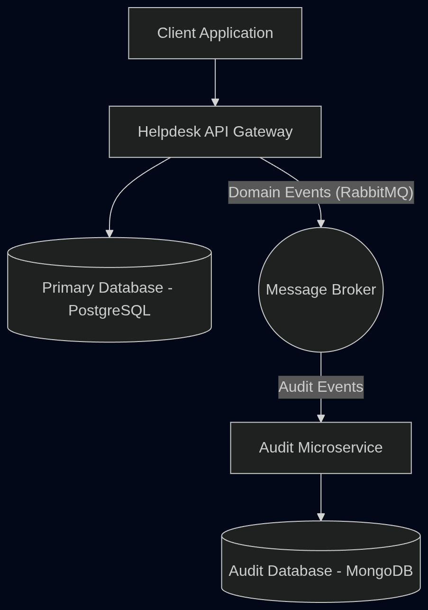

# Helpdesk System
This is a project to show my knowledge in NestJS using some architecture patterns and practices to make a software scalable, mantainable, secure and fast.

## Microservices

This repository contains the main **Helpdesk API**. 

The system is built using a microservices architecture. The Audit service is separated into its own repository:
- **Audit Microservice:** [personal-helpdesk-audit](https://github.com/ommstock/personal-helpdesk-audit)

## Software Architecture & Development Patterns

This project has been designed with enterprise-level software engineering principles to ensure scalability, maintainability, and high performance:

### 1. Microservices Architecture
The domain is decoupled into autonomous services. The Helpdesk API handles core business logic, user management, and ticket operations, while the Audit service independently tracks all system events. This separation of concerns allows each service to scale, fail, and be deployed independently.

### 2. Event-Driven Architecture (EDA)
We utilize **RabbitMQ** as a message broker to facilitate asynchronous communication between microservices. Instead of synchronous, blocking HTTP calls, the API emits Domain Events (e.g., `ticket.created`, `ticket.updated`). The Audit service subscribes to these events and processes them asynchronously. This ensures high availability, loose coupling, and reduces latency in the main API.

### 3. Domain-Driven Design (DDD) Principles
- **Domain Events:** Used to explicitly capture state changes within the system and communicate them to other bounded contexts.
- **Data Transfer Objects (DTOs):** Strict validation of incoming requests using `class-validator` and `class-transformer` to ensure data integrity and domain invariants before it reaches the domain layer.

### 4. Dependency Injection & Inversion of Control (IoC)
Leveraging NestJS's robust DI container, dependencies are explicitly injected. This promotes loose coupling and clean architecture, making the codebase highly testable through mocks and stubs. We avoid implicit state management in favor of explicit dependencies.

### 5. Security & Role-Based Access Control (RBAC)
- Custom `@Roles()` decorators and `RolesGuard` are implemented to cleanly restrict access at the controller and route levels without cluttering business logic.
- JWT-based authentication securely protects private endpoints.
- Strict input validation and payload serialization prevent sensitive data leakage (e.g., stripping password hashes from API responses).

### 6. Modern API Standards
- **Swagger / OpenAPI:** Fully documented API contracts, integrated with NestJS for seamless client integration.
- **Versioning:** API endpoints are structured to cleanly support future versioning strategies (e.g., `/api/v1/...`).

### 7. Professional Testing
- Robust End-to-End (E2E) testing suite validating full request lifecycles.
- Dummy controllers and extensive mocking of external dependencies to ensure fast, reliable test execution.

## Architecture Diagram



## Project Setup

```bash
$ pnpm install
```

## Compile and Run

```bash
# development
$ pnpm run start

# watch mode
$ pnpm run start:dev

# production mode
$ pnpm run start:prod
```

## Run Tests

```bash
# unit tests
$ pnpm run test

# e2e tests
$ pnpm run test:e2e

# test coverage
$ pnpm run test:cov
```
